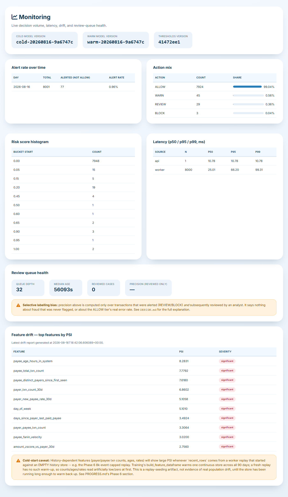
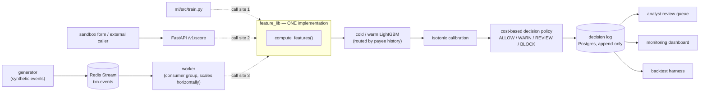
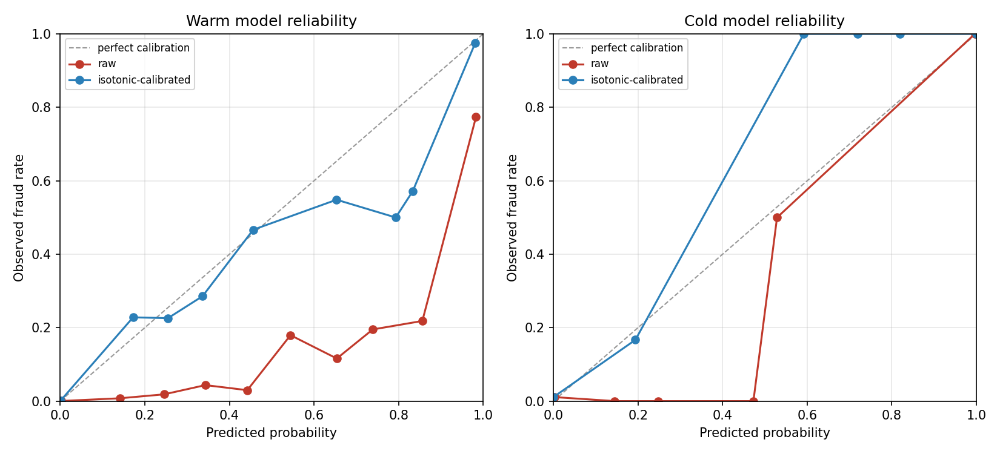

# Sentinel UPI Risk Engine

**Real-time UPI transaction risk scoring — allow / warn / review / block, decided
before the money moves.**

> All data in this project is **synthetic** (see [Results](#results-honest)). This  is a
> systems/ML engineering portfolio project, not a production fraud model.

---

## The problem

UPI fraud in India is overwhelmingly **Authorised Push Payment  (APP) fraud** — the
victim is socially engineered (a fake customer-support call, a swapped QR code, a
"collect request" disguised as a refund) and **willingly authorises the payment**.
Device fingerprint, PIN entry, and geolocation are all genuine, because it really is
the account holder, on their real device, choosing to send the money. That's
structurally different from card fraud, where the signal  is a *stolen* credential
being used by someone who isn't the account holder.

Two consequences shape this system:

- **Chargebacks, foreign-transaction flags, and high-risk-country lists don't exist
  on UPI, and are forbidden features here even where an analogue exists.** A
  chargeback is filed *after* a payment already succeeded — using it as an input
  feature is textbook post-outcome leakage, not a real-time signal.
- **Detection has to come from behavioural deviation, not credential verification.**
  Two families carry the actual signal: **payee-side behaviour** (mule fan-in — one
  account suddenly receiving from many distinct payers; account age; pass-through
  velocity) and **payer-side deviation** (first-ever payment to this VPA; amount
  z-score vs. this payer's own history; collect-request-initiated payments, a common
  APP-scam solicitation pattern).

Full reasoning, feature definitions, and every other design decision (cost matrix,
calibration choice, cold/warm split, known limitations) are in [DESIGN.md](DESIGN.md).

## Demo

<!-- TODO: replace with a real recording per docs/DEMO_SCRIPT.md, then swap this
     placeholder for an actual thumbnail image linking to the video. -->
[](docs/DEMO_SCRIPT.md)

*90-second walkthrough: replay running → live scoring → an alert → reason codes → an
analyst label → the monitoring dashboard updating. Shot list in
[docs/DEMO_SCRIPT.md](docs/DEMO_SCRIPT.md).*

**Live demo:** not deployed publicly (synthetic-data portfolio project) — run it
locally in about two minutes via [Quickstart](#quickstart) below.

## Architecture

`feature_lib` is **one implementation, three call sites** — training, the FastAPI
service, and the stream worker all call the exact same `compute_features()`, so
there is no way for train-time and serve-time feature logic to silently diverge.



## How it works

1. A raw payment event arrives (worker replay or a live API call) — just the fields
   a payment app actually knows: payer/payee VPA, amount, type, initiation mode,
   device, timestamp. No aggregates, no history, no forbidden fields.
2. The system derives features from **that payer/payee/device's own transaction
   history**, computed server-side, never supplied by the caller. Point-in-time
   correctness is enforced at the `HistoryStore` layer — a feature can only ever see
   rows strictly before the event's own timestamp.
3. If the payee has fewer than 3 prior transactions, the event routes to the
   **cold** model (payer/device-side features only); otherwise to **warm** (full
   feature set, including payee history). Cold gets stricter thresholds — it has
   less signal to work with.
4. The model's raw score is **isotonic-calibrated** on a held-out validation slice,
   so `risk_score` is an actual probability, not just a ranking.
5. A **cost-based decision policy** compares the calibrated probability against
   thresholds chosen to minimize expected cost (missed fraud vs. false-positive
   friction/review/block costs) — not a fixed 0.5 cutoff.
6. Every decision is logged immutably with its full feature snapshot and model
   version. Non-ALLOW decisions get **per-transaction SHAP reason codes** — no
   hardcoded explanation text, a genuine explanation of *that* score.

## Results, honest

| Metric | Value |
|---|---|
| Combined PR-AUC (cold+warm test set) | **0.8455** |
| — warm-only | 0.8385 |
| — cold-only | 0.9111 [95% CI 0.79–1.00, **n=22** test positives — wide, small sample] |
| — cold-only ROC-AUC | 0.9528 |
| Rules-baseline PR-AUC (sanity floor) | 0.1136 |
| Amount-weighted recall @ chosen operating point | 0.6687 |
| Precision @ chosen operating point | 0.2338 |
| p99 scoring latency (local) | 27.32ms |
| Expected cost vs. a naive 0.5 cutoff | ~2× better net benefit |

**All of this is synthetic data.** Real payment-fraud systems typically land at
PR-AUC **0.3–0.7** — the synthetic fraud typologies here, even after three rounds of
deliberate realism tuning (amount-overlap coefficient, sloppier typology variants,
mule fan-in realism), are still more separable than real fraud. This number is a
property of the dataset, not a claim about real-world performance. See
[DESIGN.md's "Known limitations of synthetic data"](DESIGN.md#known-limitations-of-synthetic-data)
for the full breakdown, including a known gap (QR_SWAP recall 0.82 vs. a 0.30
design target) that wasn't chased further.




## Threshold curve

Net benefit rises **monotonically** as the review threshold increases, from
~43.3k at `t_review=0.01` to ~48.2k at `t_review=0.91`:

```
t_review=0.01  net_benefit=43,297.78
t_review=0.11  net_benefit=47,477.78
t_review=0.21  net_benefit=47,807.78
t_review=0.31  net_benefit=47,807.78
t_review=0.41  net_benefit=47,807.78
t_review=0.51  net_benefit=48,027.78
t_review=0.61  net_benefit=48,027.78
t_review=0.71  net_benefit=48,247.78
t_review=0.81  net_benefit=48,247.78
t_review=0.91  net_benefit=48,247.78
```

At 23% precision, an analyst review costs 150 (`FP_COST_REVIEW`) more than the
marginal fraud caught by reviewing at a lower bar is worth — so the cost-optimal
policy keeps raising the bar almost indefinitely. **This is exactly the kind of
finding a cost matrix is meant to surface**, not a bug: cost minimization alone
will happily recommend reviewing almost nothing if review is expensive and the
catch rate at low thresholds is poor. A real deployment facing this curve would do
one of three things, not just take the cost-minimizing threshold at face value:
lower the actual cost of a review (better tooling, faster triage), invest in
precision at the review tier (more/better features, tighter typology coverage), or
accept a **review-capacity constraint** as the binding limit — pick the highest
threshold that still fits the team's daily review budget, rather than optimizing
cost in a vacuum.

## What I'd do differently with real data

- **Cross-institution mule intelligence.** The strongest payee-side signal (fan-in
  velocity) is entirely local to this system's own transaction history. Real mule
  networks receive from many *different banks/PSPs* — that requires shared
  intelligence across institutions, which no single bank's data can provide alone.
- **Genuine label feedback, with dispute lag modeled honestly.** This project's
  labels are generator ground truth, available instantly. Real fraud labels arrive
  weeks later (dispute windows), and only for what got reported — which is exactly 
  the selective-labelling bias below, but worse, because even "reviewed" real cases
  take a long time to resolve.
- **Device fingerprinting depth.** `device_id` here is a flat identifier; real
  systems fingerprint device attributes (OS version, sensor drift, emulator
  detection) that catch fraud rings reusing device profiles across many stolen
  identities — device_id alone misses that entirely.
- **The reviewed-cases-only labelling bias** (see [DESIGN.md](DESIGN.md#review-queue-and-selective-labelling-bias))
  is real and unresolved here: only alerted transactions ever get reviewed, so
  "precision on reviewed cases" says nothing about the ALLOW tier's true error rate.
  Fixing it for real means periodically sampling and reviewing ALLOWed traffic too
  — a holdout audit, not more reviewing of the same alerted queue.

## Quickstart

```bash
git clone <this-repo> && cd sentinel-upi-risk-engine
cp .env.example .env
docker compose up -d                              # postgres, redis, api, worker, ui
docker compose --profile tools run generator --limit 500   # replay 500 events for a quick demo
```

Then open:
- **`localhost:8000/register/`** — sign up, then log in at `/login/`.
- **`localhost:8000/prediction/`** — score a transaction by hand in the sandbox form.
- **`localhost:8000/review/`** — the analyst review queue (label alerted decisions).
- **`localhost:8000/monitoring/`** — live dashboard (alert rate, latency, drift).
- **`localhost:8001/docs`** — the FastAPI scoring service's interactive API docs.

Run the full test suite (`make test`) or an individual pipeline (`make backtest`,
`make drift`) — see the `Makefile` for all targets.

## Tech stack

FastAPI (serving) · LightGBM + isotonic calibration · SHAP (reason codes) · Redis
(online store + streams) · Postgres (decision log + Django DB) · Django (analyst
console — review queue, monitoring, sandbox — a client of the API over HTTP, not a
model host) · MLflow (local experiment tracking, no server) · Docker Compose ·
GitHub Actions (lint + full test suite + model-quality gate)

## Repo layout

```
feature_lib/     one feature implementation, imported by training/API/worker
ml/src/          generator, training, decision policy (cost matrix, thresholds)
service/         FastAPI scoring service
worker/          Redis Streams producer/consumer
decisionlog/     append-only decision log (Postgres, DB-level triggers)
pipelines/       train / backtest / drift_check / quality_gate — no Airflow/Prefect
backend/         Django analyst console (review queue, monitoring, sandbox)
sql/             raw SQL for the monitoring dashboard (no ORM, one file per query)
docs/            screenshots, demo script, archived pre-refactor history
DESIGN.md        design decisions and their reasoning
PROGRESS.md      phase-by-phase build log with every measured number
```

73 tests, ~9,510 lines of Python, 6 docker-compose services, 51 features (34
cold-safe). `ruff check .` clean.
